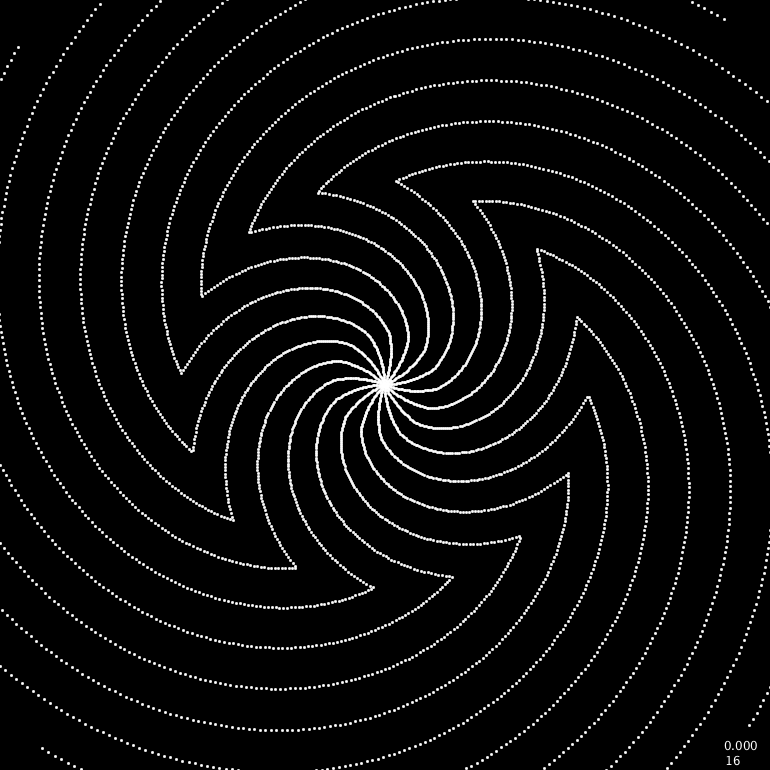

# math spiral
### Hello!

Below this text you see some images, these are some Screenshots of a project I call mathSpiral.
 
Main contributors: Tanmay Bishnoi, Shivam Singhal.
  
 
  
### Requirements
The Program(Sketch) uses the Processing IDE which can be downloaded <a href="https://processing.org/download/">
<u>here</u></a>
 
## Quick Overview (How does it work?)
The sketch displays all these different star-like points, each point has a unique index.
 
The position of each point is registered on two Arrays(Lists), one is an Array for the x-position and another is the Array for the y-position.
 
A for loop displays all the points on the Canvas(Window for the Sketch).
 
##### The true beauty lies in the assigning of each point's position, simple yet decent.
A for loop constantly increases the variable <u>Radius</u> and the variable <u>Angle</u>.
  
The user input is also taken and added to the increase rate. 
Say for example. 
Angle+=(mouseTerm+incRate): <i>Where MouseTerm is the mouse Cordinate and incRate is a constant term.</i> 
Radius+=(mouseTerm+incRate): <i>Where MouseTerm is the mouse Cordinate and incRate is a constant term.</i> 
 
<i>Next part may require some Trig prelim</i> 
The Radius is multiplied with the cosine of Angle to obtain the x-cord which is then fed to the x-Array.
  
Then the Radius is multiplied with the sin of Angle to obtain the y-cord which is then fed to the y-Array.
 For example: 
Arx[Index] = Radius . cos(Angle); : *Where Arx is the x-Array *
Ary[Index] = Radius . sin(Angle); : *Where Ary is the y-Array *

Then as told before all the points with their respective indices are displayed on the canvas.
